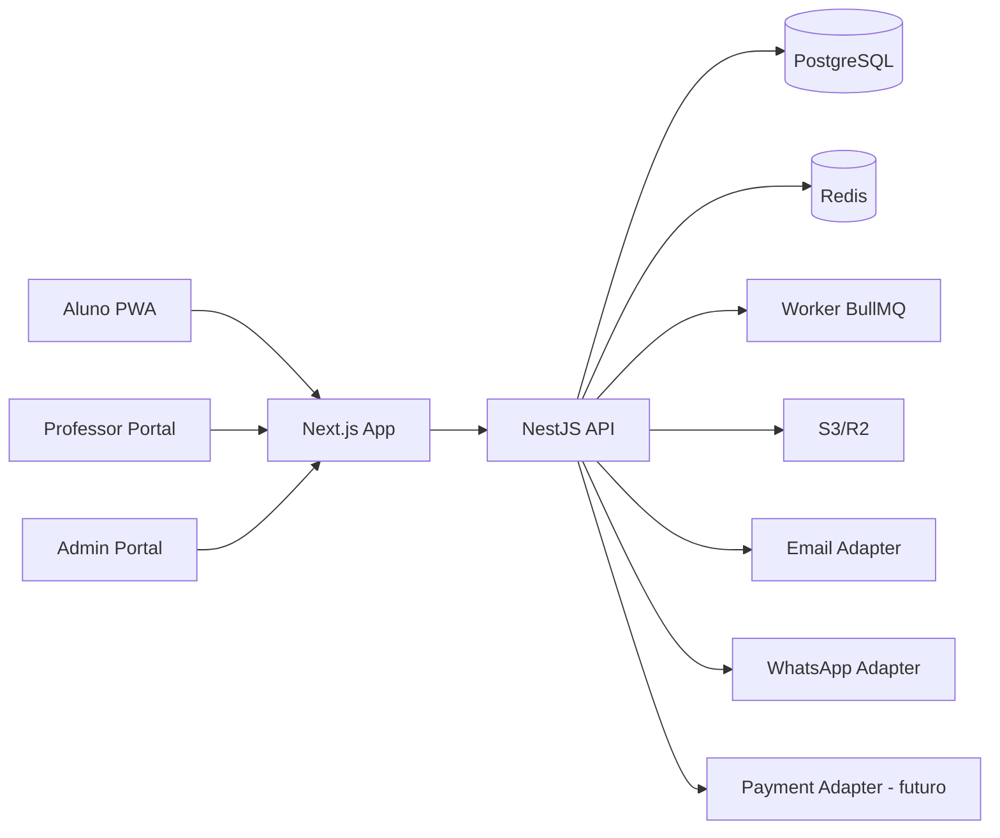
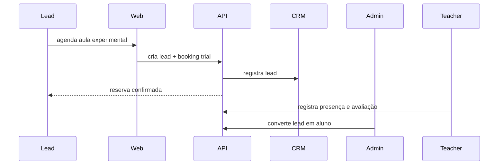
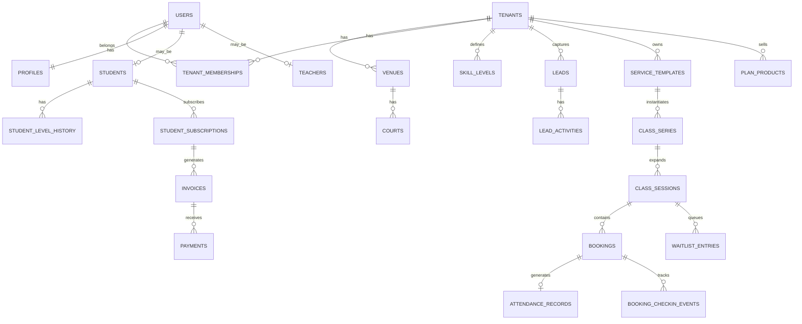
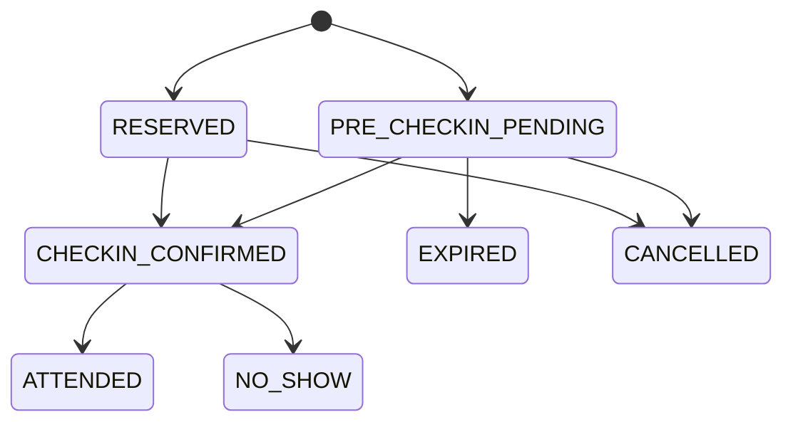

# PROJECT.md

> Documento mestre de produto, arquitetura e execução do SaaS de gestão para arenas de futevôlei e esportes de areia.
> Este arquivo é o cérebro do projeto. Toda decisão relevante de produto, regra de negócio, banco, API e UX deve partir daqui.

---

## 1. Resumo executivo

Vamos construir um **SaaS vertical para arenas de areia**, começando por um caso real de arena que hoje sofre com:

- agendamento em grupo de WhatsApp;
- novos alunos entrando via conversa manual no WhatsApp;
- falta de controle formal de vagas por turma;
- pouca visibilidade de presença, no-show, ocupação e conversão de experimental;
- operação confusa entre mensalistas, avulsos, experimentais e alunos que chegam com benefício externo.

### Decisão central revisada

**Não haverá integração direta com Wellhub/Gympass ou TotalPass na v1.**

Em vez disso, o produto vai trabalhar com um fluxo simples e operacional:

1. o aluno agenda a aula no sistema;
2. escolhe como pretende acessar a aula;
3. se o canal exigir validação presencial, a reserva entra como **pré-check-in pendente**;
4. ao chegar na arena, a recepção ou o professor confirma manualmente o check-in;
5. a reserva então passa a **confirmada**;
6. no fim, a aula vira presença ou falta.

Ou seja: o sistema resolve o caos operacional sem depender de APIs externas.

---

## 2. Objetivo do produto

Criar o sistema operacional da arena, com três superfícies principais:

- **Portal/Admin da arena**: agenda, alunos, professores, turmas, pré-check-ins, presença, financeiro e relatórios.
- **Portal do professor**: agenda do dia, alunos da aula, confirmação de presença, observações e evolução de nível.
- **Portal/PWA do aluno**: reservar aula, cancelar, entrar em fila, acompanhar plano/créditos e histórico.

### Resultado esperado

- reduzir drasticamente o agendamento por WhatsApp;
- profissionalizar o fluxo de experimental e matrícula;
- organizar lotação por turma e por canal de acesso;
- permitir confirmação manual rápida de alunos com pré-check-in;
- dar ao dono visão de ocupação, receita e operação.

---

## 3. Escopo do projeto

## 3.1 MVP

O MVP deve incluir:

1. autenticação e login por perfil;
2. arquitetura multi-tenant desde o início;
3. cadastro de arena, unidade e quadras;
4. cadastro de alunos, professores e administradores;
5. cadastro de níveis;
6. templates de aula/turma;
7. agenda recorrente e sessões avulsas;
8. reserva de vagas;
9. fila de espera;
10. fluxo de pré-check-in manual;
11. confirmação manual de check-in;
12. presença e no-show;
13. cadastro de leads e aula experimental;
14. matrícula em plano mensal;
15. aula avulsa e carteira de créditos;
16. notificações transacionais;
17. dashboard operacional do dia;
18. relatórios básicos.

## 3.2 Pós-MVP

- cobrança com Pix e cartão;
- assinatura recorrente;
- lembretes automáticos por WhatsApp;
- fila de espera com promoção automática;
- repasse/comissão de professor;
- remarcação por clima;
- multiunidade avançado;
- white-label.

## 3.3 Fora de escopo agora

- integração oficial com Wellhub, TotalPass ou similares;
- marketplace público de arenas;
- app mobile nativo;
- BI avançado com data warehouse;
- microserviços separados;
- social feed;
- ranking social/gamificação complexa.

---

## 4. Perfil dos usuários

### 4.1 Dono / Owner
Precisa enxergar:
- ocupação da arena;
- receita por tipo de aluno;
- horários mais valiosos;
- professores e turmas mais eficientes;
- conversão de experimental;
- inadimplência.

### 4.2 Admin / Recepção
Precisa operar:
- agenda;
- reservas;
- pré-check-ins pendentes;
- presença;
- cadastro;
- pagamentos;
- encaixe de alunos;
- cancelamentos;
- leads.

### 4.3 Professor
Precisa:
- ver aulas do dia;
- ver alunos da sessão;
- confirmar presença;
- marcar faltas;
- registrar observações;
- sugerir mudança de nível.

### 4.4 Aluno
Precisa:
- ver horários;
- reservar aula;
- cancelar/remarcar;
- saber se está confirmado ou em pré-check-in;
- ver plano/créditos;
- acompanhar presença e evolução.

### 4.5 Lead experimental
Precisa:
- agendar experimental sem depender do WhatsApp;
- receber instruções claras;
- ser convertido em aluno com o menor atrito possível.

---

## 5. Princípios de produto

1. **Resolver a operação real da arena antes de adicionar complexidade.**
2. **WhatsApp-friendly, mas não WhatsApp-dependent.**
3. **Reserva deve ser simples para o aluno e auditável para a arena.**
4. **Pré-check-in é declaração de intenção; confirmação manual é o evento operacional oficial.**
5. **Regras configuráveis por arena, não hardcoded.**
6. **Mobile-first para aluno e professor.**
7. **Admin-first para operação.**
8. **Arquitetura simples, legível e fácil de evoluir com Claude + Antigravity.**
9. **Modular monolith primeiro.**
10. **Multi-tenant desde o início.**

---

## 6. Decisões arquiteturais fechadas

### 6.1 Estilo de arquitetura
Usar **modular monolith**.

Motivo:
- mais rápido para lançar;
- menos custo operacional;
- menos context switching para IA e time;
- domínio ainda está em descoberta;
- facilita refino antes de quebrar em serviços.

### 6.2 Stack recomendada

#### Frontend
- **Next.js**
- **React**
- **TypeScript**
- App Router
- Tailwind CSS
- shadcn/ui
- React Hook Form
- Zod
- TanStack Query
- PWA para aluno e professor

#### Backend
- **NestJS**
- TypeScript
- REST API
- Swagger/OpenAPI
- Prisma ORM
- BullMQ para filas
- Redis para fila e cache

#### Banco principal
- **PostgreSQL**

#### Storage
- S3 compatível (AWS S3 ou Cloudflare R2)

#### Notificações
- e-mail: Resend ou SES
- WhatsApp: adapter desacoplado

#### Pagamentos
Estrutura preparada para adapter, mas pode começar sem gateway obrigatório no primeiro corte.
Quando entrar cobrança online, usar um provider brasileiro com:
- Pix
- cartão
- assinatura
- webhook confiável

### 6.3 Deploy recomendado

#### MVP
- web: Vercel
- API e worker: Railway / Fly.io / Render
- PostgreSQL gerenciado
- Redis gerenciado

#### Produção escalável
- AWS São Paulo
- ECS/Fargate
- RDS PostgreSQL
- ElastiCache Redis
- S3
- CloudFront
- WAF

---

## 7. Visão de alto nível



---

## 8. Modelo operacional do produto

Este projeto precisa tratar **acesso à aula** como conceito de negócio.

### 8.1 Canais de acesso

O sistema deve suportar estes canais:

- `MEMBERSHIP` = mensalista
- `DROP_IN` = aula avulsa
- `TRIAL` = experimental
- `BENEFIT_WELLHUB` = aluno pretende usar benefício Wellhub/Gympass, sem integração
- `BENEFIT_TOTALPASS` = aluno pretende usar benefício TotalPass, sem integração
- `COURTESY` = cortesia

### 8.2 Regra dos canais de benefício

Para `BENEFIT_WELLHUB` e `BENEFIT_TOTALPASS`:

- o sistema **não valida API externa**;
- o sistema **não faz check-in oficial no app parceiro**;
- o sistema apenas registra a intenção do aluno e controla a vaga;
- a arena confirma manualmente a chegada e a validade do acesso;
- depois disso, a reserva muda de estado.

### 8.3 Conceito de pré-check-in

**Pré-check-in** = reserva criada com exigência de validação presencial.

Exemplo:
- aluno escolhe aula de terça 19h;
- informa que pretende acessar com benefício externo;
- o sistema reserva a vaga como `PRE_CHECKIN_PENDING`;
- ao chegar na arena, a recepção confere e confirma;
- a reserva passa para `CHECKIN_CONFIRMED`.

### 8.4 Conceito de check-in confirmado

**Check-in confirmado** = evento operacional registrado pela arena informando que aquele aluno de fato chegou e teve a entrada aceita.

### 8.5 Conceito de presença

**Presença** = estado final após a aula, normalmente confirmado pelo professor.

---

## 9. Regras centrais de negócio

## 9.1 Tipos de serviço

Modelar aulas como templates configuráveis.

### Tipos padrão
- `OPEN_GROUP`
- `PERSONAL_GROUP`
- `VIP_GROUP`
- `EXCLUSIVE_1_TO_1`
- `TRIAL`

## 9.2 Políticas por template

Cada template deve suportar:
- capacidade mínima;
- capacidade máxima;
- duração;
- política de nível;
- canais permitidos;
- quota por canal;
- janela de cancelamento;
- política de no-show;
- lista de espera;
- professor padrão;
- quadras elegíveis;
- se exige pré-check-in para determinados canais.

## 9.3 Regras de lotação padrão

Valores iniciais sugeridos:
- turma aberta: até 8
- personal: até 6
- VIP: configurável, ex. 4
- exclusive: 1
- experimental: configurável, normalmente 1 ou pequeno grupo

## 9.4 Regras de nível

O aluno pode ter:
- nível autodeclarado;
- nível validado;
- histórico de evolução.

A reserva pode:
- permitir;
- permitir com alerta;
- bloquear.

## 9.5 Regras de conflito

Bloquear:
- mesma quadra no mesmo horário;
- mesmo professor em sessões conflitantes;
- mesmo aluno em duas aulas sobrepostas;
- duas reservas ativas do mesmo aluno na mesma sessão.

## 9.6 Regras de pré-check-in

Para reservas com benefício:
- criar a reserva como `PRE_CHECKIN_PENDING`;
- segurar a vaga operacionalmente;
- exigir confirmação manual até prazo configurável;
- expirar caso não seja confirmada;
- liberar vaga para fila de espera quando aplicável.

### Configuração recomendada
- prazo padrão de confirmação: até 15 minutos antes da aula ou até o início da aula, conforme regra da arena;
- isso deve ser configurável por tenant e por template.

## 9.7 Regras de cancelamento

- cancelamento dentro da janela: libera a vaga;
- cancelamento fora da janela: aplicar regra da arena;
- reservas `PRE_CHECKIN_PENDING` podem expirar automaticamente;
- toda mudança importante gera log de auditoria.

---

## 10. Fluxos principais do produto

## 10.1 Lead novo → experimental → aluno ativo



### Regras
- se o lead já existir, reaproveitar cadastro;
- trial deve gerar lembrete;
- professor deve registrar observação e nível sugerido;
- admin deve conseguir converter o lead em aluno sem recadastro.

## 10.2 Aluno mensalista ou avulso → reserva normal

Fluxo:
1. aluno abre agenda;
2. escolhe unidade, data e turma;
3. sistema valida elegibilidade;
4. cria booking como `RESERVED`;
5. aluno recebe confirmação;
6. ao chegar, recepção/professor pode confirmar check-in;
7. professor encerra como presença ou falta.

## 10.3 Aluno com benefício externo → pré-check-in

Fluxo:
1. aluno escolhe aula;
2. seleciona `BENEFIT_WELLHUB` ou `BENEFIT_TOTALPASS`;
3. sistema cria reserva como `PRE_CHECKIN_PENDING`;
4. vaga fica bloqueada operacionalmente;
5. ao chegar, recepção confirma manualmente;
6. sistema muda para `CHECKIN_CONFIRMED`;
7. ao final, professor marca `ATTENDED` ou `NO_SHOW`.

### Observação importante
Este fluxo **não depende de integração externa**. Ele existe para organizar a operação da arena.

## 10.4 Cancelamento e fila de espera

Fluxo:
1. aluno cancela ou reserva expira;
2. sistema libera vaga;
3. primeiro da fila é promovido;
4. promoção tem validade configurável;
5. se não aceitar dentro do prazo, passa para o próximo.

## 10.5 Professor confirma presença

Fluxo:
1. professor abre sessão do dia;
2. vê lista de confirmados e pendentes;
3. marca presentes/faltas;
4. registra observação opcional;
5. pode recomendar mudança de nível.

---

## 11. Perfis, login e autorização

## 11.1 Perfis do sistema

### SaaS
- `SUPER_ADMIN`

### Tenant
- `OWNER`
- `ADMIN`
- `RECEPTIONIST`
- `TEACHER`
- `STUDENT`

## 11.2 Estratégia de autenticação

### Admin, recepção e professor
- login por e-mail + senha
- reset de senha por e-mail
- MFA opcional no futuro

### Aluno
MVP:
- e-mail + senha
- ou magic link/OTP por e-mail

Fase seguinte:
- OTP por WhatsApp/SMS

## 11.3 Estratégia de sessão

- access token JWT curto
- refresh token rotativo
- sessões por dispositivo
- revogação por logout
- rate limit em login e OTP

## 11.4 Autorização

Usar **RBAC + escopo por tenant**.

Permissões exemplo:
- `tenant.manage`
- `schedule.manage`
- `student.read`
- `student.write`
- `teacher.read`
- `attendance.write`
- `billing.read`
- `reports.read`

### Regras por perfil
- `OWNER`: tudo no tenant
- `ADMIN`: tudo operacional
- `RECEPTIONIST`: agenda, reservas, check-ins, leads, alunos
- `TEACHER`: agenda própria, presença, observações, alunos da própria sessão
- `STUDENT`: apenas dados e reservas próprias

---

## 12. Multi-tenancy

## 12.1 Modelo recomendado

**Shared database + shared schema + tenant_id em todas as entidades de negócio.**

### Vantagens
- mais simples de operar;
- mais barato no começo;
- suficiente para MVP e primeira escala.

### Cuidados obrigatórios
- todo access layer deve filtrar por `tenant_id`;
- todo controller deve carregar contexto de tenant;
- logs e auditoria precisam carregar `tenant_id`;
- testes devem validar isolamento entre tenants.

## 12.2 Estratégia prática

Mesmo que o primeiro cliente seja uma única arena, a arquitetura já deve nascer multi-tenant.

### URL inicial sugerida
- `app.seudominio.com/[tenantSlug]`

### Futuro
- `[tenantSlug].seudominio.com`

---

## 13. Módulos de domínio

1. **Auth**
2. **Tenancy & Settings**
3. **Venues & Courts**
4. **People**
5. **Levels**
6. **CRM**
7. **Catalog**
8. **Scheduling**
9. **Bookings**
10. **Check-in & Attendance**
11. **Billing**
12. **Notifications**
13. **Reports**
14. **Audit & Compliance**

### Observação
O módulo de integração com parceiros foi removido da arquitetura inicial.
Se no futuro houver integração real, ela entrará como um novo módulo sem contaminar o core atual.

---

## 14. Banco de dados

## 14.1 Banco principal

- **PostgreSQL**
- extensões recomendadas:
  - `pgcrypto`
  - `citext`
  - `pg_trgm`

## 14.2 Entidades principais



## 14.3 Tabelas de autenticação

### `users`
- `id`
- `email`
- `phone_e164`
- `password_hash`
- `status`
- `email_verified_at`
- `phone_verified_at`
- `last_login_at`
- `created_at`
- `updated_at`

### `profiles`
- `user_id`
- `full_name`
- `birth_date`
- `avatar_url`
- `gender`
- `emergency_contact_name`
- `emergency_contact_phone`

### `tenant_memberships`
- `id`
- `tenant_id`
- `user_id`
- `role`
- `status`
- `invited_by`
- `joined_at`

### `auth_sessions`
- `id`
- `user_id`
- `tenant_id`
- `refresh_token_hash`
- `device_label`
- `ip_address`
- `user_agent`
- `expires_at`
- `revoked_at`
- `created_at`

### `password_reset_tokens`
- `id`
- `user_id`
- `token_hash`
- `expires_at`
- `used_at`

### `otp_challenges`
- `id`
- `user_id`
- `channel`
- `destination`
- `code_hash`
- `expires_at`
- `verified_at`

## 14.4 Tabelas de tenancy e estrutura física

### `tenants`
- `id`
- `name`
- `slug`
- `status`
- `timezone`
- `default_locale`
- `created_at`
- `updated_at`

### `tenant_settings`
- `tenant_id`
- `branding_json`
- `booking_rules_json`
- `checkin_rules_json`
- `billing_rules_json`
- `notification_rules_json`

### `venues`
- `id`
- `tenant_id`
- `name`
- `slug`
- `address_line`
- `city`
- `state`
- `zip_code`
- `lat`
- `lng`
- `status`

### `courts`
- `id`
- `tenant_id`
- `venue_id`
- `name`
- `sport_type`
- `surface_type`
- `is_covered`
- `status`

## 14.5 Tabelas de pessoas e níveis

### `students`
- `id`
- `tenant_id`
- `user_id`
- `active_level_id`
- `source`
- `medical_notes`
- `goals`
- `status`

### `teachers`
- `id`
- `tenant_id`
- `user_id`
- `bio`
- `specialties_json`
- `hire_type`
- `status`

### `skill_levels`
- `id`
- `tenant_id`
- `name`
- `code`
- `rank_order`
- `description`

### `student_level_history`
- `id`
- `tenant_id`
- `student_id`
- `from_level_id`
- `to_level_id`
- `changed_by_user_id`
- `reason`
- `created_at`

## 14.6 Tabelas de CRM

### `leads`
- `id`
- `tenant_id`
- `full_name`
- `phone_e164`
- `email`
- `source`
- `status`
- `desired_level_id`
- `desired_days_json`
- `desired_time_ranges_json`
- `owner_user_id`
- `notes`
- `created_at`

### `lead_activities`
- `id`
- `tenant_id`
- `lead_id`
- `type`
- `payload_json`
- `created_by_user_id`
- `created_at`

## 14.7 Tabelas de catálogo e agenda

### `service_templates`
- `id`
- `tenant_id`
- `name`
- `service_kind`
- `modality`
- `duration_min`
- `min_capacity`
- `max_capacity`
- `level_policy`
- `min_level_id`
- `max_level_id`
- `allowed_access_channels_json`
- `channel_quotas_json`
- `allow_waitlist`
- `cancellation_window_hours`
- `checkin_deadline_min`
- `no_show_policy_json`
- `price_rules_json`
- `status`

### `class_series`
- `id`
- `tenant_id`
- `service_template_id`
- `venue_id`
- `default_court_id`
- `default_teacher_id`
- `rrule`
- `start_date`
- `end_date`
- `status`

### `class_sessions`
- `id`
- `tenant_id`
- `class_series_id`
- `service_template_id`
- `venue_id`
- `court_id`
- `teacher_id`
- `start_at`
- `end_at`
- `min_capacity`
- `max_capacity`
- `channel_quotas_json`
- `status`

## 14.8 Tabelas de reserva, pré-check-in e presença

### `bookings`
- `id`
- `tenant_id`
- `session_id`
- `student_id` nullable
- `lead_id` nullable
- `declared_access_channel`
- `validated_access_channel` nullable
- `status`
- `source`
- `payment_status`
- `reserved_at`
- `pre_checkin_at` nullable
- `checkin_confirmed_at` nullable
- `confirmed_by_user_id` nullable
- `cancelled_at` nullable
- `cancellation_reason`
- `notes`

### `booking_checkin_events`
- `id`
- `tenant_id`
- `booking_id`
- `event_type`
- `actor_user_id` nullable
- `payload_json`
- `created_at`

### `waitlist_entries`
- `id`
- `tenant_id`
- `session_id`
- `student_id`
- `position`
- `status`
- `created_at`
- `promoted_at`
- `expires_at`

### `attendance_records`
- `id`
- `tenant_id`
- `booking_id`
- `status`
- `checkin_at`
- `checkout_at`
- `validated_by_user_id`
- `validation_source`

## 14.9 Tabelas financeiras

### `plan_products`
- `id`
- `tenant_id`
- `name`
- `product_type`
- `billing_cycle`
- `sessions_per_cycle`
- `credit_amount`
- `price_cents`
- `currency`
- `allowed_template_ids_json`
- `rules_json`
- `status`

### `student_subscriptions`
- `id`
- `tenant_id`
- `student_id`
- `plan_product_id`
- `status`
- `start_date`
- `end_date`
- `renews_at`
- `billing_provider`
- `external_subscription_ref`

### `wallet_transactions`
- `id`
- `tenant_id`
- `student_id`
- `type`
- `amount`
- `balance_after`
- `reference_type`
- `reference_id`
- `created_at`

### `invoices`
- `id`
- `tenant_id`
- `student_id`
- `subscription_id`
- `amount_due_cents`
- `amount_paid_cents`
- `currency`
- `due_date`
- `status`
- `description`
- `external_invoice_ref`

### `payments`
- `id`
- `tenant_id`
- `invoice_id` nullable
- `booking_id` nullable
- `provider`
- `method`
- `status`
- `amount_cents`
- `external_payment_ref`
- `paid_at`
- `metadata_json`

## 14.10 Tabelas de comunicação e auditoria

### `message_logs`
- `id`
- `tenant_id`
- `channel`
- `recipient`
- `template_key`
- `status`
- `payload_json`
- `sent_at`

### `audit_logs`
- `id`
- `tenant_id`
- `actor_user_id`
- `entity_type`
- `entity_id`
- `action`
- `before_json`
- `after_json`
- `ip_address`
- `created_at`

---

## 15. Enums recomendados

### `service_kind`
- `OPEN_GROUP`
- `PERSONAL_GROUP`
- `VIP_GROUP`
- `EXCLUSIVE_1_TO_1`
- `TRIAL`

### `access_channel`
- `MEMBERSHIP`
- `DROP_IN`
- `TRIAL`
- `BENEFIT_WELLHUB`
- `BENEFIT_TOTALPASS`
- `COURTESY`

### `booking_status`
- `WAITLISTED`
- `RESERVED`
- `PRE_CHECKIN_PENDING`
- `CHECKIN_CONFIRMED`
- `ATTENDED`
- `NO_SHOW`
- `CANCELLED`
- `EXPIRED`

### `attendance_status`
- `PRESENT`
- `ABSENT`
- `LATE`
- `EXCUSED_ABSENCE`

### `lead_status`
- `NEW`
- `CONTACTED`
- `TRIAL_BOOKED`
- `TRIAL_ATTENDED`
- `OFFER_SENT`
- `CONVERTED`
- `LOST`

### `payment_status`
- `NONE`
- `PENDING`
- `PAID`
- `FAILED`
- `REFUNDED`
- `WAIVED`

### `checkin_event_type`
- `PRE_CHECKIN_CREATED`
- `PRE_CHECKIN_REMINDER_SENT`
- `ARRIVAL_CONFIRMED`
- `CHECKIN_REJECTED`
- `CHECKIN_EXPIRED`
- `ATTENDANCE_MARKED`

---

## 16. Índices e restrições críticas

Criar índices compostos em:

- `bookings (tenant_id, session_id, status)`
- `bookings (tenant_id, student_id, status)`
- `class_sessions (tenant_id, start_at, status)`
- `class_sessions (tenant_id, teacher_id, start_at)`
- `class_sessions (tenant_id, court_id, start_at)`
- `student_subscriptions (tenant_id, student_id, status)`
- `invoices (tenant_id, status, due_date)`
- `leads (tenant_id, status, created_at)`
- `attendance_records (tenant_id, checkin_at)`
- `booking_checkin_events (tenant_id, booking_id, created_at)`
- `tenant_memberships (tenant_id, user_id, role)`

Restrições importantes:

- unicidade de `tenant.slug`;
- unicidade de `venue.slug` dentro do tenant;
- impedir duas reservas ativas do mesmo aluno na mesma sessão;
- impedir conflito de quadra no mesmo horário;
- impedir conflito de professor no mesmo horário.

---

## 17. Estrutura backend por módulos

## 17.1 Módulos

### `auth`
Responsável por:
- login;
- refresh;
- reset de senha;
- OTP/magic link;
- sessões.

### `tenancy`
Responsável por:
- tenant;
- branding;
- settings;
- memberships.

### `venues`
Responsável por:
- unidades;
- quadras;
- bloqueios de quadra.

### `people`
Responsável por:
- usuários;
- perfis;
- alunos;
- professores.

### `levels`
Responsável por:
- CRUD de níveis;
- evolução;
- histórico.

### `crm`
Responsável por:
- leads;
- atividades;
- conversão;
- pipeline simples.

### `catalog`
Responsável por:
- templates de serviço;
- planos;
- regras financeiras;
- regras de acesso.

### `scheduling`
Responsável por:
- séries recorrentes;
- geração de sessões;
- conflitos;
- remarcação.

### `bookings`
Responsável por:
- reservas;
- validações de elegibilidade;
- fila de espera;
- quotas por canal;
- criação de pré-check-in.

### `checkin-attendance`
Responsável por:
- confirmação manual de chegada;
- eventos de check-in;
- presença;
- no-show;
- expiração de pré-check-ins.

### `billing`
Responsável por:
- planos;
- assinaturas;
- faturas;
- pagamentos;
- créditos/carteira.

### `notifications`
Responsável por:
- templates;
- e-mail;
- WhatsApp;
- lembretes;
- jobs.

### `reports`
Responsável por:
- dashboards;
- ocupação;
- receita;
- performance operacional.

### `audit`
Responsável por:
- logs de auditoria;
- rastreabilidade;
- histórico de ações sensíveis.

---

## 18. Frontend: apps, rotas e UX

## 18.1 Estratégia de frontend

Usar um único app **Next.js** com rotas segmentadas por papel.

## 18.2 Rotas públicas

- `/`
- `/[tenant]/book`
- `/[tenant]/trial`
- `/[tenant]/login`
- `/[tenant]/register`

## 18.3 Rotas do aluno

- `/[tenant]/app/student/dashboard`
- `/[tenant]/app/student/schedule`
- `/[tenant]/app/student/bookings`
- `/[tenant]/app/student/wallet`
- `/[tenant]/app/student/profile`

## 18.4 Rotas do professor

- `/[tenant]/app/teacher/dashboard`
- `/[tenant]/app/teacher/today`
- `/[tenant]/app/teacher/session/[id]`
- `/[tenant]/app/teacher/profile`

## 18.5 Rotas do admin

- `/[tenant]/app/admin/dashboard`
- `/[tenant]/app/admin/schedule`
- `/[tenant]/app/admin/sessions`
- `/[tenant]/app/admin/bookings`
- `/[tenant]/app/admin/pre-checkins`
- `/[tenant]/app/admin/checkins`
- `/[tenant]/app/admin/students`
- `/[tenant]/app/admin/teachers`
- `/[tenant]/app/admin/leads`
- `/[tenant]/app/admin/plans`
- `/[tenant]/app/admin/billing`
- `/[tenant]/app/admin/reports`
- `/[tenant]/app/admin/settings`

## 18.6 Padrões de UX

### Aluno
- reserva em poucos passos;
- filtros por unidade, nível e horário;
- status claro da reserva;
- CTA visível para cancelamento e fila.

### Professor
- interface minimalista;
- foco na aula do dia;
- checkboxes rápidos para presença.

### Admin/Recepção
- agenda em grade por quadra;
- fila de pré-check-ins pendentes;
- ação rápida de confirmar chegada;
- destaque para vagas críticas e lotação.

### Estados visuais importantes
- reservado;
- pré-check-in pendente;
- check-in confirmado;
- presente;
- faltou;
- fila de espera.

---

## 19. API design

## 19.1 Padrão geral

- REST JSON
- `/v1`
- OpenAPI/Swagger
- validação rigorosa
- paginação cursor-based para listas grandes
- idempotency key em endpoints críticos

## 19.2 Endpoints principais

### Auth
- `POST /v1/auth/login`
- `POST /v1/auth/refresh`
- `POST /v1/auth/logout`
- `POST /v1/auth/request-password-reset`
- `POST /v1/auth/reset-password`
- `POST /v1/auth/request-otp`
- `POST /v1/auth/verify-otp`

### Tenant e membros
- `GET /v1/tenants/:tenantId`
- `PATCH /v1/tenants/:tenantId`
- `GET /v1/tenants/:tenantId/members`
- `POST /v1/tenants/:tenantId/members/invite`

### Estrutura física
- `GET /v1/venues`
- `POST /v1/venues`
- `GET /v1/courts`
- `POST /v1/courts`

### Pessoas
- `GET /v1/students`
- `POST /v1/students`
- `GET /v1/students/:id`
- `PATCH /v1/students/:id`
- `GET /v1/teachers`
- `POST /v1/teachers`

### CRM
- `GET /v1/leads`
- `POST /v1/leads`
- `POST /v1/leads/:id/convert`

### Níveis
- `GET /v1/levels`
- `POST /v1/levels`
- `POST /v1/students/:id/level-change`

### Catálogo
- `GET /v1/service-templates`
- `POST /v1/service-templates`
- `GET /v1/plan-products`
- `POST /v1/plan-products`

### Agenda
- `GET /v1/sessions`
- `POST /v1/class-series`
- `POST /v1/sessions`
- `PATCH /v1/sessions/:id`
- `POST /v1/sessions/:id/cancel`

### Reservas
- `POST /v1/sessions/:id/book`
- `POST /v1/bookings/:id/cancel`
- `POST /v1/bookings/:id/promote-from-waitlist`

### Pré-check-in e presença
- `POST /v1/bookings/:id/request-pre-checkin`
- `POST /v1/bookings/:id/confirm-checkin`
- `POST /v1/bookings/:id/reject-checkin`
- `POST /v1/bookings/:id/mark-attended`
- `POST /v1/bookings/:id/mark-no-show`

### Billing
- `POST /v1/subscriptions`
- `GET /v1/invoices`
- `POST /v1/payments/checkout`
- `POST /v1/webhooks/payments/:provider`

### Reports
- `GET /v1/reports/operations/daily`
- `GET /v1/reports/occupancy`
- `GET /v1/reports/revenue`
- `GET /v1/reports/channel-performance`

---

## 20. Fluxo detalhado de estado da reserva

## 20.1 Jornada padrão



## 20.2 Regras por estado

### `RESERVED`
Reserva válida criada para mensalista, avulso, trial ou cortesia.

### `PRE_CHECKIN_PENDING`
Reserva criada aguardando validação presencial pela arena.

### `CHECKIN_CONFIRMED`
Chegada confirmada manualmente.

### `ATTENDED`
Aluno participou da aula.

### `NO_SHOW`
Aluno não compareceu ou não pôde ser validado.

### `EXPIRED`
Pré-check-in não foi confirmado dentro da janela.

### `CANCELLED`
Reserva cancelada manualmente.

---

## 21. Jobs e filas

## 21.1 Filas necessárias

- `notifications`
- `session-materialization`
- `waitlist-promotion`
- `booking-expiration`
- `payment-webhooks`
- `report-refresh`

## 21.2 Jobs recorrentes

- gerar sessões futuras de séries recorrentes;
- expirar reservas `PRE_CHECKIN_PENDING` fora da janela;
- promover fila de espera;
- enviar lembrete 24h e 2h antes da aula;
- gerar dashboard diário;
- alertar sobre experimental sem follow-up.

---

## 22. Observabilidade e auditoria

## 22.1 Logs estruturados

Campos mínimos:
- timestamp
- level
- service
- request_id
- tenant_id
- user_id
- module
- action
- duration_ms

## 22.2 Auditoria obrigatória

Registrar em `audit_logs`:
- criação e cancelamento de reserva;
- confirmação de check-in;
- mudança de nível;
- alteração de sessão;
- alterações financeiras;
- convites e mudanças de perfil.

## 22.3 Alertas operacionais

- muitas reservas expirando sem confirmação;
- fila de espera acumulada;
- falha de webhook de pagamento;
- jobs parados;
- erro 5xx acima do normal.

---

## 23. Segurança e LGPD

## 23.1 Segurança mínima

- hash de senha forte: Argon2id
- HTTPS obrigatório
- refresh token rotativo
- rate limit em login, OTP e rotas sensíveis
- validação server-side em tudo
- secrets fora do repositório
- sanitização de payloads

## 23.2 Dados sensíveis

Tratar como sensíveis:
- observações médicas;
- lesões;
- restrições físicas;
- contatos de emergência.

## 23.3 Regras LGPD

- minimização de dados;
- consentimento quando aplicável;
- trilha de acesso;
- retenção configurável;
- anonimização/deleção quando necessário.

---

## 24. Relatórios e métricas

## 24.1 Dashboard diário operacional

- aulas do dia
- lotadas
- vagas restantes
- pré-check-ins pendentes
- experimentais do dia
- leads sem follow-up
- professores do dia
- inadimplentes impactando acesso

## 24.2 Relatórios essenciais

- ocupação por quadra
- ocupação por professor
- ocupação por canal de acesso
- presença por turma
- no-show por aluno
- conversão de experimental
- receita por hora de quadra
- receita por plano
- cancelamentos
- reservas expiradas por pré-check-in não confirmado

## 24.3 KPIs principais

- taxa de ocupação
- receita por hora de quadra
- no-show rate
- cancelamento rate
- trial → paid conversion
- active students
- tempo médio para preencher vaga cancelada
- percentual de reservas com pré-check-in que viram presença

---

## 25. Estrutura de repositório recomendada

```text
repo/
  apps/
    web/
      src/
        app/
        components/
        features/
        lib/
    api/
      src/
        main.ts
        modules/
          auth/
          tenancy/
          venues/
          people/
          levels/
          crm/
          catalog/
          scheduling/
          bookings/
          checkin-attendance/
          billing/
          notifications/
          reports/
          audit/
    worker/
      src/
        queues/
        jobs/
  packages/
    ui/
    config/
    types/
    utils/
    eslint-config/
    tsconfig/
  prisma/
    schema.prisma
    migrations/
  docs/
    adr/
    api/
```

### Ferramentas recomendadas
- pnpm
- Turborepo
- ESLint
- Prettier
- Husky
- Vitest/Jest
- Playwright

---

## 26. Convenções para Claude + Antigravity

### 26.1 Regras de implementação

- controllers sem regra de negócio pesada;
- regras de negócio ficam em services/use-cases;
- DTOs separados de entidades;
- validação sempre com schema;
- queries de banco encapsuladas;
- nunca misturar lógica de tenant com lógica de auth de forma implícita;
- toda feature precisa declarar:
  - inputs
  - outputs
  - regras
  - erros possíveis
  - eventos de auditoria.

### 26.2 Ordem sugerida de construção

1. base do monorepo
2. banco e Prisma
3. auth + tenancy
4. venues + courts + levels
5. service templates + class series + sessions
6. bookings + waitlist
7. pré-check-in + confirmação manual
8. leads + trial flow
9. student portal
10. teacher portal
11. billing básico
12. notificações
13. relatórios
14. hardening e testes

### 26.3 ADRs

Toda decisão importante fora deste documento deve virar um ADR em `docs/adr`.

---

## 27. Roadmap por fases

## Fase 0 — Fundação
- monorepo
- auth
- tenancy
- banco
- design system base

## Fase 1 — Core operacional
- unidades
- quadras
- níveis
- templates
- agenda
- sessões

## Fase 2 — Reserva e check-in
- reservas
- quotas por canal
- fila de espera
- pré-check-in
- confirmação manual
- presença/no-show

## Fase 3 — Comercial e CRM
- leads
- experimental
- conversão para aluno
- dashboard operacional

## Fase 4 — Financeiro
- planos
- créditos
- assinaturas
- cobrança

## Fase 5 — Escala
- notificações avançadas
- relatórios melhores
- comissões
- clima/remarcação
- white-label

---

## 28. O que mudou nesta revisão

1. removida a integração direta com Wellhub/TotalPass da arquitetura inicial;
2. removido módulo de parceiros;
3. removidos webhooks e adapters específicos de parceiros;
4. adicionado fluxo de **pré-check-in manual** como parte central do core;
5. simplificado o modelo operacional para focar no problema real do primeiro cliente;
6. mantido suporte para o aluno informar o canal de acesso pretendido;
7. ajustado banco, estados da reserva, filas e relatórios para refletir esse fluxo.

---

## 29. Decisão final do projeto

A v1 deste SaaS deve ser posicionada como:

**Plataforma de operação e agendamento para arenas de areia, com controle de turmas, alunos, experimental, pré-check-in e presença.**

O objetivo inicial não é automatizar parceiros externos.
O objetivo é **tirar a operação do WhatsApp e colocar a arena no controle da agenda**.

